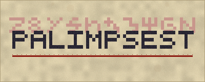

<p align="center"></p>

# Palimpsest

*This world was written over another.*

**Palimpsest** is a slow-burning horror and mystery mod for **Minecraft Java 1.20.1** (Forge).

A palimpsest is a manuscript page that was scraped clean and written over. The older text
never quite goes away. Given time, it shows through.

Your world is the new writing. The old writing is still under it. Walk far enough, stay long
enough, read the wrong page, and it starts to show: a torch you're sure you left lit has gone
out, a sign says something you didn't write, there's one more cow in the field than there was.
It starts as small things you could explain away. It doesn't stay small.

> This README avoids spoilers. Design notes with full spoilers are in
> [`docs/DESIGN.md`](docs/DESIGN.md). Don't read it before you play.

---

## Contents

- [Requirements](#requirements)
- [Installation](#installation)
- [Building from source](#building-from-source)
- [What's in it](#whats-in-it)
- [Getting started](#getting-started-light-hints)
- [Controls and commands](#controls-and-commands)
- [Configuration](#configuration)
- [Accessibility](#accessibility)
- [Multiplayer](#multiplayer)
- [Performance and compatibility](#performance-and-compatibility)
- [Development](#development)
- [Assets and licenses](#assets-and-licenses)
- [Known limitations](#known-limitations)

---

## Requirements

| | |
|---|---|
| Minecraft | **1.20.1** (Java Edition) |
| Mod loader | **Forge 47.1 or newer** (built against 47.3.0) |
| Java | 17 |
| Side | Required on **both** client and server |

### Why Forge

For 1.20.1, Forge is the loader with the most mature toolchain and the widest modpack
ecosystem. It also ships the pieces this mod relies on most as stable APIs: capabilities
(per-player state that survives death and dimension changes), data-driven biome modifiers
(so Overworld generation can be switched off in config), `SimpleChannel` networking, GameTest
integration, and client hooks for fog, sky, sound and overlays. Fabric could do all of this,
but it would mean hand-writing several of these systems on top of mixins.

## Installation

1. Install Minecraft Forge for 1.20.1 (47.1 or newer).
2. Put `palimpsest-1.0.0.jar` in the `mods` folder.
3. Start the game. A new world is best: the story starts in the Overworld and builds up over
   several in-game days.

On a server, put the same jar in the server's `mods` folder. Every player needs it too.

## Building from source

```bash
./gradlew build            # jar ends up in build/libs/
./gradlew runClient        # dev client
./gradlew runServer        # dev dedicated server
./gradlew runGameTestServer  # boots a server, runs the mod's game tests, exits
```

The first build downloads Minecraft and Forge (several hundred MB) from
`maven.minecraftforge.net`, `libraries.minecraft.net` and `piston-meta.mojang.com`.
You need a JDK 17. The Gradle wrapper is included.

Every push to GitHub is built and tested by [`.github/workflows/build.yml`](.github/workflows/build.yml):

1. `tools/check.py` cross-checks every registered block, item, entity, sound and translation
   key against the generated resources.
2. `./gradlew build` compiles and reobfuscates the mod.
3. `./gradlew runGameTestServer` boots a dedicated server and runs the GameTests in
   `src/main/java/.../test/`. They cover the Bleed stages and save/load, recipe/advancement/
   loot/template loading, real Undertext terrain generation, locating an Undertext structure,
   gate frames, scraped blocks coming back, and rubric chalk stopping inkborn.
4. `./gradlew runClient` under a virtual display runs a scripted client smoke test
   (`client/dev/SmokeTest`, only active with `-Dpalimpsest.smokeTest=true`). It creates a
   world, lays out every block, item and creature, fires all 34 horror events, checks that the
   Bleed survives a change of dimension, visits every Undertext biome and a copy of every
   structure, and opens every screen. It takes a screenshot at each stop and fails the build
   if anything throws.

## What's in it

- **The Bleed.** An invisible per-player measure of how much the older text has seeped into
  your life. It has seven stages, from *Clean Page* to *Overwritten*. It rises slowly just from
  living in the world, and faster with some choices. It never jumps without a reason, and there
  are ways to push it back down.
- **A horror director.** More than thirty scripted events, from sounds you could half-believe
  to ones that are very hard to explain away. Which events can happen depends on your stage,
  where you are, what time it is and what you've already seen, so the same thing shouldn't
  happen twice in a row. Many events can't hurt you. Some can.
- **Creatures.** Seventeen of them, each with its own behaviour. Some are ordinary animals of
  the older world, some prey on people, and some are rules more than monsters: they only
  follow you, or only come when called, or only exist while you aren't looking. Most are
  harmless once you understand them. A few are not. The tall ones are not stopped by low
  ceilings or small holes either: they bend double under anything two blocks high and crawl
  flat through a gap one block high.
- **The Undertext.** A dimension with six biomes, its own sky, fog, light, ambience and music.
  It isn't a darker Nether: it's the earlier draft of the world, and it's built on the same
  kinds of places you already know.
- **Fourteen structures** across both dimensions, with loot, notes and secrets. The Overworld
  ones are hidden in plain sight.
- **A writing-based crafting system**: inks, surfaces, quills, a **Scriptorium Desk** for
  transcription, and **rites** worked at a **Rubric Altar**. Rites can depend on the moon, the
  weather, the dimension and your Bleed, and they can go wrong.
- **The Commonplace Book**, a codex (82 entries) that fills itself in as you notice things.
  Found writing (torn folios, faded pages, logs left by other people) tells the rest.
- **Two bosses, several endings**, and a final choice that changes how your world behaves.
- **40 advancements**, about 115 items and 55 blocks, more than 90 recipes, and 140
  original sound files.

## Getting started (light hints)

- Craft a **Commonplace Book** early (book, oak gall, feather). Oak galls fall from oak
  leaves now and then. Keep the book in your inventory: it writes down what you notice.
  Press **J** to read it.
- **Red ink matters.** Vermilion comes from cinnabar, which is found deep underground.
- If something knocks, you don't have to answer.
- If you count your animals, count them in daylight.
- Sleeping properly is good for you.

## Controls and commands

| Key | Action |
|---|---|
| `J` (rebindable) | Open the Commonplace Book (it must be in your inventory) |

Everything else uses vanilla controls: use items, place blocks, open containers.

Operator commands (permission level 2):

```
/palimpsest bleed get [player]
/palimpsest bleed set <players> <0-1000>
/palimpsest bleed add <players> <amount>
/palimpsest event <event id> [player]      # trigger a horror event (testing / showcases)
/palimpsest codex unlockall [player]
/palimpsest reset <players>                # clear Bleed, codex, ending and flags
```

## Configuration

There are two config files. `palimpsest-common.toml` is per world/server and lives in the
world's `serverconfig` folder. `palimpsest-client.toml` is per player and lives in `config/`.

**Common (gameplay, server-authoritative)**

| Option | Default | Effect |
|---|---|---|
| `horrorIntensity` | 1.0 | 0 to 2: how strong events are |
| `eventFrequency` | 1.0 | 0.1 to 4: how often events happen |
| `bleedGainMultiplier` | 1.0 | 0 to 5: how fast the Bleed rises (0 freezes it) |
| `enableFinalStage` | true | Allow the last stage (can be turned off for gentler worlds) |
| `bleedDecaysWhileResting` | true | Sleeping lowers the Bleed a little |
| `gracePeriodDays` | 1 | In-game days in a new world before anything happens |
| `allowWorldAlteration` | true | Events may change blocks (snuff torches, open doors, move items); everything is restored or harmless |
| `allowTears`, `maxTearsPerPlayer` | true, 3 | Late-stage hazards that open near players |
| `allowScraping` | true | Some things can temporarily erase blocks (never block entities; always restored) |
| `allowGates` | true | Player-built gates to the dimension |
| `generateOres`, `generateScars`, `generatePlants` | true | Overworld worldgen additions |
| `enableKnocker`, `enableCopyist`, `enableLonghand`, `enableFairCopy`, `enableErratum` | true | Switch individual visitors off |
| `redactedRenamesItems` | true | Allow one creature's cosmetic item-name effect |
| `overworldSpawnMultiplier` | 1.0 | Scales natural Overworld spawns |
| `sharedApparitions` | true | Whether players standing nearby also see another player's apparitions |
| `fakeChatMessages` | true | Allow late-stage messages that look like chat. Only the target player sees them. They may borrow the name of someone who is online |
| `cooperativeRitualBonus` | 0.05 | How much safer a rite gets for each extra player nearby |

**Client**: see [Accessibility](#accessibility).

## Accessibility

All of these are in `palimpsest-client.toml` and take effect without a restart.

| Option | Default | Effect |
|---|---|---|
| `flashingEffects` | true | Sky and screen flashes. **Turn off if you're sensitive to flashing light.** |
| `screenDistortion` | true | Camera tilt, sway and shake |
| `inkVignette`, `vignetteStrength` | true, 1.0 | Ink creeping in at the screen edges |
| `fogEffects` | true | Event fog and Undertext fog |
| `visualHorror` | true | Brief visual apparitions (faces, sky changes) |
| `darknessIntensity` | 1.0 | 0.25 to 1: how dark and desaturated the dimension looks |
| `horrorVolume` | 1.0 | Volume of all of this mod's sounds |
| `softenStingers` | false | Play loud stingers quieter |
| `importantSoundCaptions` | false | Directional captions for the sounds that matter (knocking, footsteps) even with vanilla subtitles off |
| `ambientParticles` | true | Ambient ink and ash particles |

Every sound has a vanilla subtitle.

## Multiplayer

- Bleed, codex and progress are tracked **per player**. Each player gets their own story,
  at their own pace.
- Events are aimed at one player. Apparitions can be seen by players standing nearby, and
  servers can turn that off with `sharedApparitions`. World changes (doors, torches) are real
  and visible to everyone, and they are always restored or harmless.
- Rites worked with other people nearby are safer.
- Bosses get +50% health for each extra player nearby (up to eight players) when a fight begins.
- Everything is server-authoritative. The client only renders what it's told.

## Performance and compatibility

- The horror director runs once per second per player and only does work when an event is
  due. Structure and creature discovery checks run every five seconds.
- There are no tile-entity-heavy structures and no per-tick scans of loaded chunks.
- Overworld additions use biome modifiers and can be switched off in config. The dimension
  is entirely data-driven (`data/palimpsest/worldgen`, `dimension`, `dimension_type`), so
  datapacks can override it.
- Vanilla loot tables are only extended, never replaced (oak leaves, a few chests).

## Development

```
src/main/java/com/exonoxic/palimpsest/
  bleed/        per-player state (capability), stages, discovery, endings
  horror/       the event director and ~30 events
  entity/       creatures, bosses, AI helpers, apparitions
  block/ item/  blocks, block entities, items
  recipe/       transcription and rite recipes (custom JSON types)
  world/        dimension, gates, features, structures, loot hooks
  client/       renderers, models, sky, fog, overlays, screens, sounds
  network/      packets
  test/         GameTests (run in CI)
tools/          Python generators for every asset and data file
```

All textures, entity models, sounds, structures and JSON data are produced by the scripts in
`tools/`. They're deterministic, so re-running them gives byte-identical output.

```bash
pip install numpy scipy pillow soundfile
python3 tools/gen_textures.py     # block/item/gui/particle/sky textures, logo
python3 tools/gen_models.py       # entity models (Java) + their textures
python3 tools/gen_sounds.py       # all .ogg files + sounds.json
python3 tools/gen_structures.py   # structure templates (.nbt)
python3 tools/gen_data.py         # blockstates, models, loot, recipes, tags, advancements, worldgen, lang
python3 tools/check.py            # cross-checks Java registries against every generated file
```

`tools/check.py` catches the mistakes a compiler can't: a block with no blockstate, an item
with no model or name, a model pointing at a missing texture, a sound with no file, a
translation key used in code but missing from `en_us.json`, an advancement granted from Java
that doesn't exist, a recipe or loot table naming an item that isn't registered, and so on.

## Assets and licenses

- **Code**: GPL-3.0-or-later (see [`LICENSE`](LICENSE)).
- **Art, sound, music, models, structures, text**: all original to this project, released
  under the same license. Nothing was scraped, sampled or traced from other games, mods,
  sound libraries or artists.
  - Textures and the logo are drawn procedurally by `tools/gen_textures.py`,
    `tools/tex_blocks.py`, `tools/tex_items.py` and `tools/gen_models.py` from a small
    hand-picked palette, value noise and hand-authored glyphs (`tools/glyphs.py`).
  - Every sound effect and the music disc are synthesised from scratch (oscillators, filtered
    noise, simple physical models, convolution with generated impulse responses) by
    `tools/synth.py` and `tools/gen_sounds.py`. No recordings are used.
  - Entity models are original geometry defined in `tools/gen_models.py`.
  - All lore, codex text and in-world writing is original (`tools/lore.py`).
- **Vanilla assets** are only *referenced at runtime*, never redistributed. A few renderers
  reuse Minecraft's own models and textures, loaded from the player's game files. Minecraft
  is © Mojang Studios. This mod is not affiliated with or endorsed by Mojang or Microsoft.
- The build uses Minecraft Forge (LGPL-2.1) and Mojang's official mappings under their
  respective licenses. Neither is included in this repository.

## Known limitations

- Needs to be installed on both client and server (it adds blocks, entities and a dimension).
- Balance comes from design and short playtests, not long survival runs. Expect to tune
  `bleedGainMultiplier` and `eventFrequency` for your group.
- Only English (`en_us`) is included. Translations are welcome.
- Some visual effects (sky, fog, lightmap) may interact oddly with shader packs.
